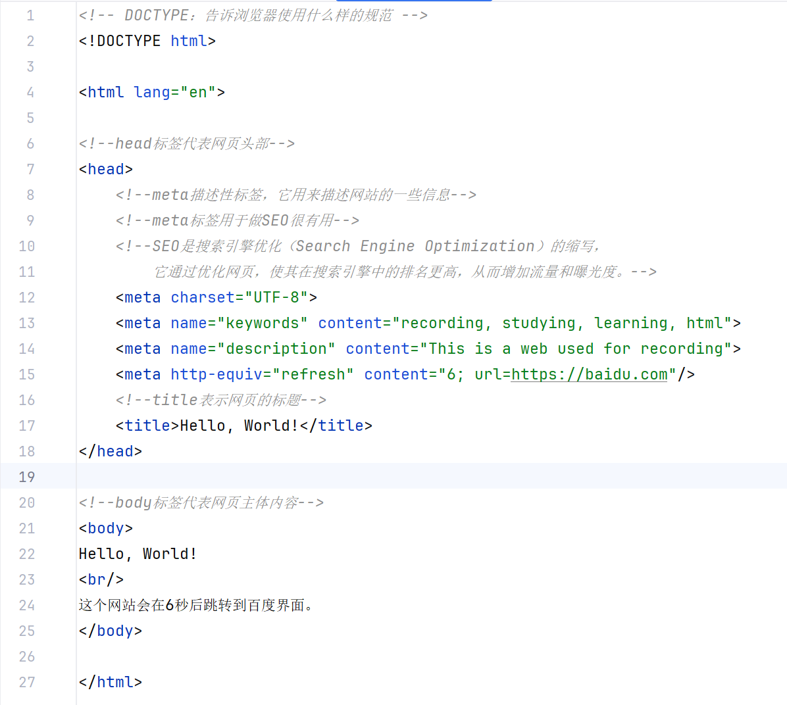
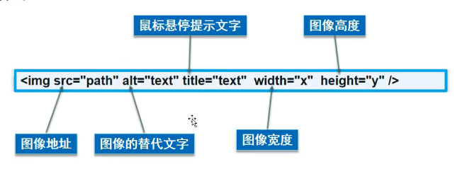
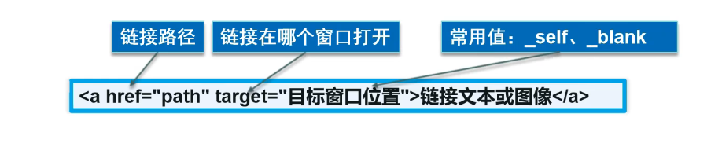
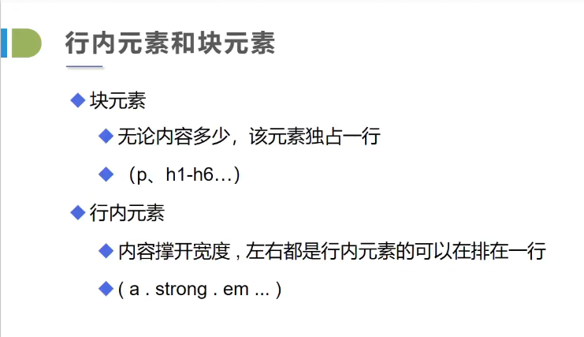
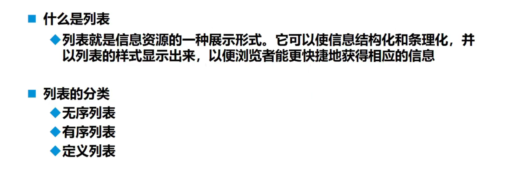
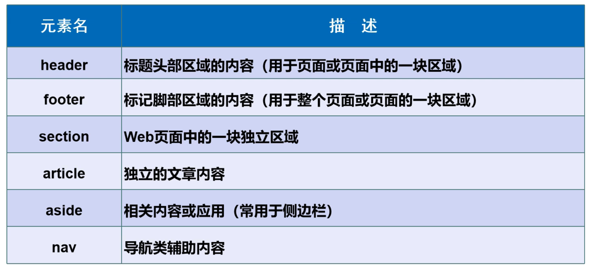
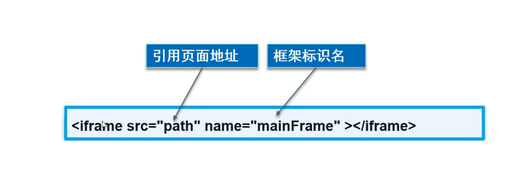
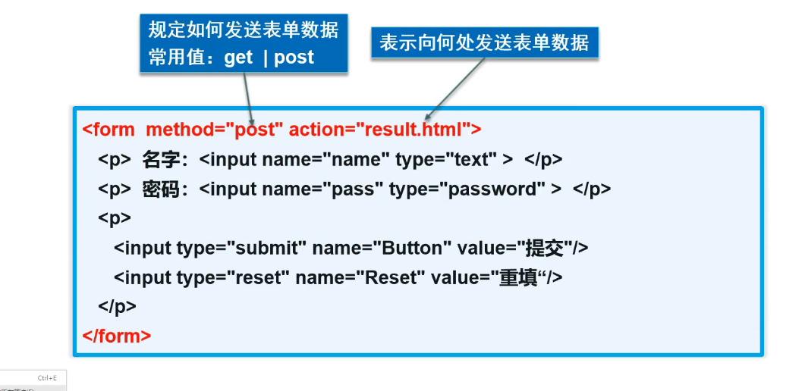

# HTML学习

## HTML基本概念：

---

HTML就是在不同的标签内部填内容，使其组合成一个网页。

- 只有一个标签的叫做：**自闭和标签**；<body>叫做**开放标签**、</body>叫做**闭合标签** 。
    - 自闭和标签往往是针对不需要加入其他东西，可以自成一派的标签类型。如：`input` 、`hr` 、`br` 、`img` 、`audio`自己就能完成任务
    - 普通标签往往是起到约束框架或者给定样式的“装饰器”作用，需要内部填入其他内容以组成完整的使用案例。如：`strong` 、`em` 、`select` 、`textarea` 、`table` 、`ol ul dl`
- 区分是自闭和标签还是成对标签的方法是看要修饰的内容是否需要限定范围，例如换行符`<br>`完全不用限定范围，但标题标签需要限制文字范围以设置格式，所以需要成对标签。

### 初识HTML元素



所有的HTML语言内容都需要包裹在`<html>` 与`</html>` 便签对当中才有效。

**`head` 标签对中内容：**

- **`m**eta`标签表示的是页面的全局性信息：包括编码格式、关键词、页面描述等内容。在考虑增加页面曝光度而调整SEO的时候，这里的元素可以有效增加被查找的概率。
    - `keywords` 表示页面关键词
    - `description` 表示页面完整描述
    - `http-equiv` 只有两个重要作用：定义页面使用的编码与定义页面自动跳转
        - 编码可以通过`<meta charset="UTF-8"/>` 来快速设置。完整方式是：`<meta http-equiv="Content-Type" content="text/html; charset=utf-8" />`
        - 自定义跳转则是：`<meta http-equiv="refresh" content="{等待秒数}; {跳转界面}">`
- `title` 标签表示页面在浏览器中打开后，标签页显示的文字。
- `style` 与`link`标签与CSS样式有关
- `script` 与Javascript语言有关

**`body` 标签对中内容：**

页面主要内容都是在`body` 标签对中书写才视为有效

### 基本标签：

**标题标签**


通过`<h1>...</h1>` 的形式定义一级标签等…

**段落标签**


通过`<p>...</p>` 标签对创建段落，段落中文字的行距比直接写在`<body>`中的文字行距要大，但是无论内容中存在多少空格，显示的时候只显示一个

**水平线标签**


水平线标签`<hr/>` 是一个自闭和标签，最后的`/` 用于表示闭合，可以省略

**换行标签**


换行标签`<br/>` 也是一个自闭和标签，用于将内容换行，否则文字内容不会自动换行，即使在IDE中显示了换行效果

**字体样式标签**


粗体：`<strong>...</strong>` 用于加粗文字

斜体(emphasize)：`<em>…</em>` 用于创造斜体文字

下标(superscript)：`<sup>...</sup>` 用于给标签包裹的文字设置为下标

上标(subscript)：`<sub>…</sub>` 用于给标签包裹的文字设置为上标

下划线(underline)：`<u>…</u>` 用于给标签内文字添加下划线

删除线(strikethrough)：`<s>…</s>` 用于给标签内文字添加删除线效果

**特殊符号**


空格：`&nbsp;` 版权符号：`&copy;` …

**特殊符号使用方式**：

- 一定以`&` 开头
- 对于符号调用的代码只用记住首字母然后根据IDE中的提示查找运用即可
- 记住常用的即可

### 图像标签

图像格式：




图像标签的关键元素是：`src` 与`alt` ，分表代表了图像所在位置与当图像无法正常加载时显示的解释语。

`path` 推荐使用相对路径而不是绝对路径来撰写代码，这样更加方便其他人调用项目中的资源，`../` 代表此代码项目的上一级文件。

```html
<!DOCTYPE html>
<html lang="en">
<head>
    <meta charset="UTF-8">
    <title>图像标签学习</title>
</head>
<body>
<!--img标签学习
src：图像地址
    绝对地址（从盘符开始写的即为绝对路径）
    相对地址（推荐使用）
    ../  --上一级目录
-->


<br>

</body>
</html>
```

### **链接标签**



1. 基础链接标签

在`href` 中填写超链接链接到的目标网址，`target` 显示链接到页面以怎样的方式打开`_self` 代表在现在的标签页打开，`_blank` 代表在新标签页打开。

在`<a>` 、`</a>` 中填写超链接的文字或者图像，用于点击跳转。

1. 锚链接
    1. 需要一个锚标记
    2. 跳转至标记位置（顶部，底部...）
    3. 通过井号'#'跳转到页面相应位置，而不是从头开始
- 锚标记添加方式：`<a id="top">顶部</a>` ，其中`id` 设置此锚点的唯一标识字段。
- 本页面调用方式：`<a href="#top">回到顶部</a>`，`href` 中填写`# + <id字段>` 超链接至本页的特定位置（在书签中常用）
- 其余页面调用方式：`<a href="<页面名称.html>#<id字段>"> …</a>` 用于在其他页面中设置锚链接跳转。
1. 功能链接
    1. 邮件链接：`mailto:`

使用方式：`<a href="mailto:{邮箱号}">{描述性文字}</a>` 用于链接至他人邮箱账户。


### 块元素与行内元素



关键是使用的标签是否自动换行，换了的就算做块标签，如果没换行而是不断扩充行长度叫做行内标签。

常见块标签：

`<h1>...</h1>` 、`<p>…</p>` 

常见行内标签：

`<strong>...</strong>`、`<em>…</em>`

### 列表标签



**有序列表**

- `<ol>`、`</ol>` :表示有序列表
- `<li>` 、`</li>` ：表示列表中内容

```html
<ol>
  <li>Java</li>
  <li>Python</li>
  <li>C++</li>
  <li>C#</li>
</ol>
```


可以通过设置`type` 标签来规定列表项符号

| 属性值 | 列表项符号 |
| --- | --- |
| 1 | 1. 2. 3. |
| a | a. b. c. |
| A | A. B. C. |
| i | i. ii. iii. |
| I | I. II. III. |

**无序列表**

- `<ul>`、`</ul>` ：表示无序列表

```html
<ul>
  <li>Java</li>
  <li>Python</li>
  <li>C++</li>
  <li>C#</li>
</ul>
```


可通过设置`type`属性来规定列表项符号

| 属性值 | 列表项符号 |
| --- | --- |
| disc | 实心圆 |
| circle | 空心圆 |
| square | 正方形 |

**自定义列表：***不需要排序或者拥有符号在前*

- `<dl>`、`</dl>` ：表示`define list`
- `<dt>`、`</dt>` ：表示自定义列表的`term` （列名）
- `<dd>`、`</dd>` ：表示自定义列表的`description`


### 表格标签

设置表格标签的时候，**一定需要先确定行**，在向行中插入列；完成后对于某一个单元格再设置跨越行、列数；这里设置的跨越行列数会挤占其他位置，导致其他位置上的元素位置改变，可以边编写边修改。

- *行标签： `tr`*（table row）
    - 跨行显示：`rowspan="{number}"`
- *列标签：`td`* （table data cell）
    - 跨列显示：`colspan="{number}"`
- *表格标题：`caption`*
- *表头单元格：`th` （table head cell）*
    - 其中的内容会使用粗体、居中的形式呈现，`td` 中是不会的。
- *设置表格外边框： `border="{像素值}"`*

```html
<table border="1px">
  <caption>测试表格:</caption>
  <tr>
    <th>第一列</th>
    <th>第二列</th>
  </tr>
  <tr>
    <!--跨列显示-->
    <td colspan="3">1-1</td>
  </tr>
  <tr>
    <!--跨行显示-->
    <td rowspan="2">2-1</td>
    <td>2-2</td>
    <td>2-3</td>
  </tr>
  <tr>
    <td>3-1</td>
    <td>3-2</td>
  </tr>
</table>
```


**列表语义化**

- `<thead>…</thead>` 表示表格的头部
- `<tbody>...</tbody>` 表示表格的内容部分
- `<tfoot>…</tfoot>` 表示表格的尾部

### 媒体元素

缺少控件`controls` 的媒体无法直接正常显示和播放

video标签:

- `src`：视频资源路径
- `controls`：控制视频的播放、暂停、快进等
- `autoplay`：控制视频的自动播放

audio标签:

- `src`：音频资源路径
- `controls`：控制音频的播放、暂停、音量等
- `autoplay`：控制音频的自动播放

### 页面结构分析

在html发展的过程中，形成了一些约定俗称的元素名，掌握这些元素名可以更好得对开源代码进行分析和理解→增强**语义化**



常用元素有：`header` 、`footer` 、`nav` 

### iframe内联框架



iframe就像是一个标签页中**小型的浏览器容器**，作用主要有两个：

1. 可以作为`<a>` 标签打开网页的target地址
2. 直接在这个容器中放入网址
- `src`: 内联网站的地址
- `width`: 宽度
- `height`: 长度
- `name` ：设置此框架的引用名称（`<a>` 标签中的`target` （显示href的目标位置）可以使用）

```html
<iframe src="https://www.baidu.com" name="hello"  frameborder="0" width="1000px" height="800px">

</iframe>
```

在`<a>` 标签中使用:

```html
<a href="3.%20图像标签.html" target="hello">点击跳转</a>
```

### 表单语法



**参数解释**：

- action: **表单提交的位置**，可以是网站或者请求处理的地址
- method: 表单不同的提交方式（post、get）
    - get方式提交：我们可以在action指定的页面的url中显示提交的信息，高效但不安全（适合初学者查看效果）
    - post方式提交：密码无法在url中显示（可以在网络->负载中查看），可以传输大文件
    
    
    
- target：设置提交后提交网址的打开方式，“_blank”在新窗口打开，”_self”在此窗口打开。

**表单内元素创建方式：`<input>` 标签：**

文本输入框：

`<input type="text" name="username" value="开卷有益" maxlength="8" size="30">`

- `value` 表示文本框中默认存在值，用户可以进行编辑，最终提交的`value`为用户填写的信息
- `name` 表示键，和`value` 组合，构成键值对，方面按照后端的逻辑进行网页信息解析
- `maxlength` 表示文本框允许输入的最大长度，`size` 表示文本框的大小

单选框：

```html
  <p>性别:
    <input type="radio" value="boy" name="sex" checked/>男
    <input type="radio" value="girl" name="sex"/>女
  </p>
```

- `value`:表示单选框被选中时，提交到后端的值（值）
- `name`:表示“组”的概念，如果设置单选框时，需要将多个选项设置为同一组，这样才能发挥“单选”的价值（键）
- `checked` 表示默认选中
- 外部显示的文字代表用户看到的文字提示

多选框：

```html
<p>爱好:
    <input type="checkbox" value="sleep" name="hobby"/>睡觉
    <input type="checkbox" value="code" name="hobby" checked/>敲打吗
    <input type="checkbox" value="game" name="hobby"/>游戏
    <input type="checkbox" value="girl" name="hobby"/>女孩
  </p>

```

与上述单选框的参数差不多，只修改了`intput type` 的值，还是需要设置一个`name` 与对应选项的`value`

按钮：

HTML中的按钮包括多种格式：

`input type="button"` --最基础的按钮类型

`input type="image"`  --点击图片后之后**提交表单**

`input type="submit"` --点击提交后按照`method` 提交表单的全部信息

`input type="reset"` -- 点击后重置全部填写的信息

普通按钮：

```html
  <p>按钮:
    <input type="button" name="btn1" value="点击变长">
  </p>
```

- `value` 规定了按钮上显示的值

图片按钮：

```html
  <p>图片按钮:
    <input type="image" src="../resources/img/1.jpg" width="768" height="432">
  </p>
```

提交&重置按钮：

```html
  <p>
    <input type="submit">
    <input type="reset">
  </p>
```

文件域：

```html
  <p>请上传文件:
    <input type="file" name="files">
    <input type="button" value="上传" name="upload">
  </p>
```

下拉框：

下拉框的创建使用`select` 标签，下拉框内部内容的填入使用`option` 标签

```html
  <p>下拉框:
    <select name="country" [multiple] [size=""]>
      <option value="US" selected>美国</option>
      <option value="CN" >中国</option>
      <option value="AUS">澳大利亚</option>
      <option value="INDIA">印度</option>
    </select>
  </p>
```

同样的，`name` 表示‘键’，`value` 表示‘值’

其他属性：

- `mutiple` 设置该下拉框支持多选（设置此属性之后，下拉框会默认呈现展开状态供多选使用）
- `size` 设置下拉框显示选项的个数，可配合`mutiple`设置显示的选项个数

文本域：

创建一个供用户随意填入文本的域使用：`textarea` 标签

```html
  <p>个人介绍:
    <textarea name="textarea" cols="50" rows="2">
      请输入个人介绍
    </textarea>
  </p>
```

- `rows`:表示文本域行数
- `cols`:表示文本域列数
- `name`:表示输入后端的键值
- 用户在域中填入的信息作为`value` 随表单一起提交；文本域的默认输入与单个文本框的不同，不写在标签定义中，而是写在开放标签和闭合标签之间。

**一些自带验证功能的表单元素：**

邮箱验证：(更复杂的验证规则后期使用JavaScript来写)

```html
<p>邮件:
    <input type="email" name="email">
  </p>
```

URL验证：

```html
  <!--URL验证-->
  <p>URL:
    <input type="url" name="url">
  </p>
```

数字验证：

```html
  <p>数字:
    <input type="number" name="num" max="100" min="0" step="2">
  </p>
```

- `step` 参数设置点击数字框的“增加”按钮增加的数值大小

**其他一些常用的模块**

滑块功能：

```html
<p>滑块:
    <input type="range" name="voice" min="0" max="100" step="2">
  </p>
```

搜索框功能（支持点击叉号一键消除输入）：

```html
  <!--搜索框-->
  <p>关键词输入:
    <input type="search" name="search">
  </p>
```

### 表单的常见运用模式

**只读模式**：在`in*put`* 标签中写入`readonly` 属性，即可将模块设置为只读，不允许修改

```html
<!--文本输入框设置只读属性-->
    <p>名字:<input type="text" name="username" value="开卷有益" maxlength="8" size="30" readonly></p>
```

**隐藏模式：**在一些情况中，你可能需要隐藏某些元素，可以在对应的`input` 标签中设置`hidden="hidden"` ，这样，用户就看不见这个元素

```html
<!--密码框设置隐藏域-->
    <p>密码:<input type="password" name="pwd" value="123456" hidden="hidden"></p>
```

**禁用模式：**对于按钮等元素，我们有时希望它是默认选定一个结果且不能修改的，我们可以设置`disabled` ，禁用这个元素

在如下代码中，“男”这个选项被选中且无法更改

```html
    <!--单选框
    设置单选框禁用:disabled
    -->
    <p>性别:
        <input type="radio" value="boy" name="sex" checked disabled/>男
        <input type="radio" value="girl" name="sex" disabled/>女
    </p>
```

**增强鼠标可用性：**使用`label`标签完成增强鼠标可用性的目标：用户点击这个标签，输入光标就会跳转到对应的元素中

使用步骤:

1. 在`input` 标签中设置该元素的`id` 值
2. 在`label` 标签中`for` 属性填入此`id` 值
3. 完成设置

```html
    <!--label标签用于增强鼠标可用性-->
    <p>
        <label for="intro">你点我试试:</label>
        <input type="text" name="intro" id="intro">
    </p>
```

### 表单的验证

**设置元素的输入提示**：在`input` 标签中设置`placeholder=”{这是提示文字}”` 可以在显示提示信息，用户输入后提示信息消失

```html
  <!--文本输入框设置输入提示
    placeholder --提示信息
    -->
    <p>名字:<input type="text" name="username" maxlength="8" size="30" placeholder="请输入用户名"></p>
```

**设置表单必填项**：在`input` 标签中设置`required` 属性，让此页面元素在未填值时不允许提交

```html
   <!--密码框设置必填提示
    required  --必填项，否则不能提交
    -->
    <p>密码:<input type="password" name="pwd" value="123456" required></p>
```

**设置正则表达式**：在`input` 标签中设置`pattern="{正则表达式}"` 可以实现对填入信息按照正则表达式进行验证。（可以搜索“常用的正则表达式”完成填写）

```html
<p>名字:<input type="email" name="useremail" maxlength="8" size="30" pattern="^\w+([-+.]\w+)*@\w+([-.]\w+)*\.\w+([-.]\w+)*$"></p>
```